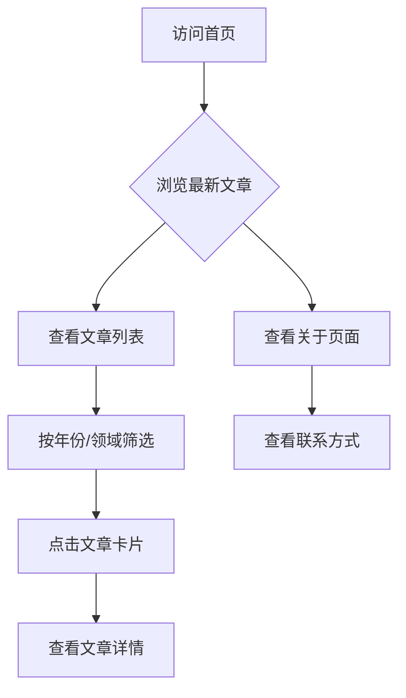

## 1. 产品概述

教授学术主页静态页面，用于展示个人学术成果、研究论文和出版物，支持定期更新维护。
- 面向学术同行、学生、研究人员及访问者，提供教授个人学术信息的集中展示平台
- 简洁易维护的静态页面方案，无需后台服务，通过修改数据文件即可更新内容

## 2. 核心功能

### 2.1 用户角色
| 角色 | 访问方式 | 核心权限 |
|------|---------|----------|
| 访问者 | 直接访问页面 | 浏览所有公开信息 |
| 管理员（教授本人） | 直接编辑静态文件 | 更新文章、个人信息 |

### 2.2 功能模块
1. **首页**：个人简介、研究领域、最新文章概览
2. **文章列表页**：按时间排序的全部学术文章
3. **文章详情页**：单篇文章的完整内容展示
4. **关于页面**：详细的个人履历、教育背景、联系方式

### 2.3 页面详情
| 页面名称 | 模块名称 | 功能描述 |
|---------|---------|---------|
| 首页 | 英雄区 | 教授姓名、职称、单位、研究领域标语 |
| 首页 | 精选文章 | 展示3-5篇精选/最新文章卡片 |
| 首页 | 快捷统计 | 论文总数、引用数、H-index 等学术指标 |
| 文章列表 | 筛选排序 | 按年份、研究领域分类筛选 |
| 文章列表 | 文章卡片 | 标题、摘要、发表日期、标签、DOI 链接 |
| 文章详情 | 文章内容 | 完整标题、作者、摘要、正文、参考文献 |
| 关于页面 | 个人履历 | 教育经历、工作经历、学术兼职 |
| 关于页面 | 联系方式 | 邮箱、办公地址、Google Scholar 链接 |

## 3. 核心流程
访问者浏览文章的主要流程：

## 4. 用户界面设计

### 4.1 设计风格
- **主色调**：深蓝/藏青 (#1a2a4a) 为主色，搭配暖金色 (#c9a84c) 作为点缀
- **辅助色**：浅灰 (#f5f5f0) 背景，深灰 (#2d2d2d) 正文
- **字体**：标题使用衬线字体（如 Lora 或 Playfair Display），正文使用无衬线字体（如 Inter）
- **布局**：卡片式布局，左右留白充裕，纵向排版清晰
- **按钮样式**：简约线条风格，hover 时渐变填充
- **整体风格**：学术典雅、沉稳大气，视觉上传递专业与可信赖感

### 4.2 页面设计概览
| 页面名称 | 模块名称 | UI 元素 |
|---------|---------|---------|
| 首页 | 英雄区 | 大标题、副标题、背景微妙渐变、头像或首字母标识 |
| 首页 | 文章卡片 | 卡片阴影、圆角、标签徽章、日期标记 |
| 文章列表 | 年份分组 | 年份标题做锚点，侧边快速导航 |
| 文章详情 | 顶部信息 | 元数据栏（作者、日期、DOI） |
| 关于页面 | 时间线 | 垂直时间线展示经历 |

### 4.3 响应式设计
- 桌面优先设计，适配平板和手机端
- 移动端卡片改为单列布局，导航折叠为汉堡菜单
- 文章详情页在移动端优化字体大小和行距