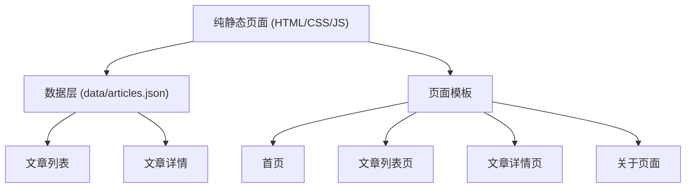
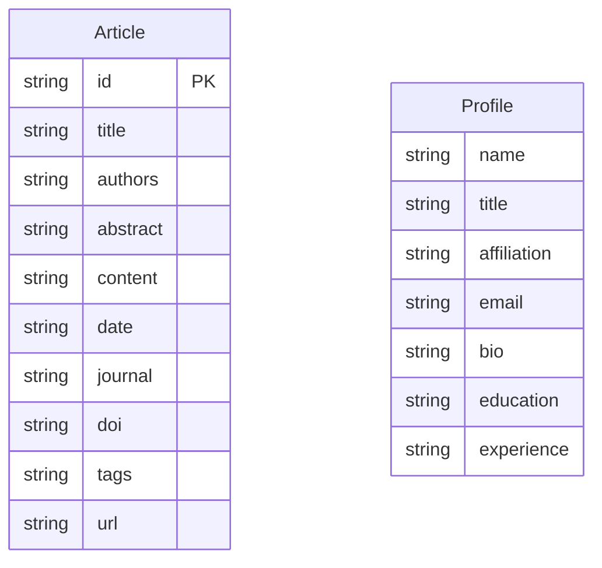

## 1. 架构设计



## 2. 技术描述
- **前端**：纯 HTML5 + CSS3 + JavaScript（无需框架，方便维护）
- **构建工具**：无（纯静态，直接编辑文件）
- **后端**：无
- **数据存储**：JSON 文件（data/articles.json 存储所有文章数据）
- **部署方式**：可直接部署至 GitHub Pages、Netlify 或任何静态服务器

## 3. 路由定义
| 路径 | 用途 |
|------|------|
| / | 首页 |
| /articles.html | 文章列表页 |
| /article.html?id=xxx | 文章详情页 |
| /about.html | 关于页面 |

## 4. 数据模型
### 4.1 数据模型定义



### 4.2 数据结构定义
```json
{
  "articles": [
    {
      "id": "2024-001",
      "title": "文章标题",
      "authors": "作者列表",
      "abstract": "文章摘要",
      "content": "文章完整内容（Markdown 格式）",
      "date": "2024-03-15",
      "journal": "期刊名称",
      "doi": "10.xxxx/xxxxx",
      "tags": ["机器学习", "自然语言处理"],
      "url": "https://doi.org/..."
    }
  ],
  "profile": {
    "name": "教授姓名",
    "title": "教授/博导",
    "affiliation": "所属机构",
    "email": "email@university.edu",
    "bio": "个人简介",
    "education": [
      {"period": "2000-2004", "school": "XX大学", "degree": "博士"}
    ],
    "experience": [
      {"period": "2010-至今", "position": "教授", "organization": "XX大学"}
    ],
    "stats": {
      "papers": 120,
      "citations": 5000,
      "h_index": 35
    }
  }
}
```